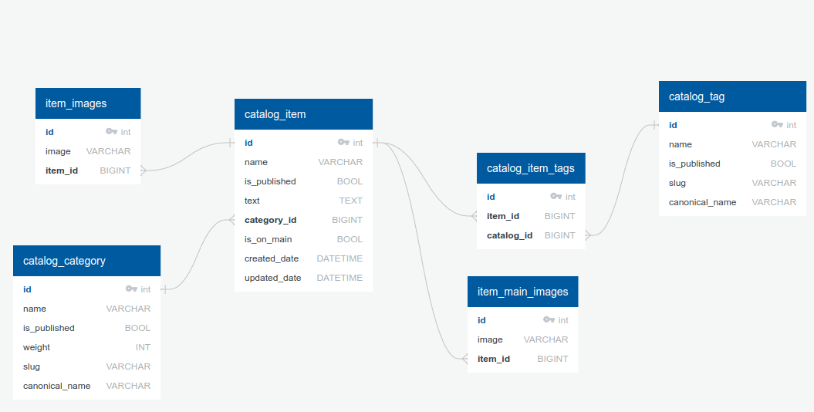

# Клонирование проекта

Перед запуском проекта его необходимо скачать из репозитория, для этого у
должен быть установлен [гит](https://skillbox.ru/media/code/chto_takoe_git_obyasnyaem_na_skhemakh/).
Создайте папку в которой будет размещен проект и откройте в ней терминал (так, чтобы при вводе команды
`ls ..` выводилось название, созданной вами, директории). Для клонирования проекта введите команду:  
`git clone https://gitlab.crja72.ru/django/2024/spring/course/students/43836-Mr.BoyMan-yandex.ru-course-1112.git`

# Запуск проекта (Linux)

Перед запуском проекта откройте терминал в папке рядом
с папкой проекта (так, чтобы при вводе команды `ls` у вас
отображалась папка [lyceum](lyceum), файл [requirements.txt](requirements/prod.txt) и др.)

Cоздадим виртуальное окружение командой:  
`python -m venv venv`

Чтобы активировать его выполните следующую команду:  
`source venv/bin/activate`

После этого в самой левой части строки терминала должна появится
надпись (venv).

Для запуска приложения понадобиться файл .env, который должен содержать
определенные переменные, в качестве примера можете посмотреть файл [.env-test](.env-test)
в котором уже вставлены данные для тестового запуска. Теперь, чтобы
на основе [.env-test](.env-test) создать обычный .env, введите следующую команду:  
`cp .env_test .env`

Проект можно запускать уже на этом этапе, однако рекомендую внести свои
данные в .env дабы избежать проблем с безопасностью, в самом файле есть
комментарии, для правильного его заполнения.

Теперь установим зависимости, запуск проекта для проверки работоспособности
потребует ввода команды:  
`pip install -r requirements/prod.txt`

Зависимости, необходимые для разработки проекта, можно установить командой:   
`pip install -r requirements/dev.txt`

А для запуска проекта в режиме теста команда:  
`pip install -r requirements/test.txt`

Перейдем в папку с проектом, команда:  
`cd lyceum`

В таком случае при вводе команды `ls` вы должны увидеть файлы [manage.py](lyceum%2Fmanage.py),
[db.sqlite3](lyceum%2Fdb.sqlite3), папку [lyceum](lyceum%2Flyceum) и другие. Запустим
наш проект командой:  
`python manage.py runserver`

После этого при переходе на адрес http://127.0.0.1:8000/ у вас должна открыться
страница приветствия, это означает, что проект успешно запущен.

## Тестирование

Для выполнения тестирования рекомендую создать новое окружение (можно создать рядом с существующим, но с другим именем)
по инструкции выше. После этого установить зависимости для тестирования (команда приведена выше). Для
запуска тестов всех модулей введите команду:  
`python manage.py test`

В случае успешного тестирования в выводе появится вердикт "ОК".

# ER-диаграмма
Для создания ER-диаграммы можно использовать [DbVisualizer](https://www.dbvis.com/), после
скачивание нужно подключить базу данных. Для этого нужно создать новое подключение, 
выбрать тип СУБД Sqlite и указать путь до файла с БД. После этого развернуть базу данных 
и кликнуть на элемент списка "Таблицы", в открывшемся справа окне выбрать References.

# Перевод
Для создания динамического перевода на сайте необходимо запустить команды:  
`django-admin makemessages -a`    
`django-admin compilemessages`

## Статус проверки

